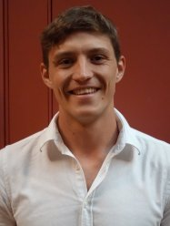

  

### Welcome!

Thanks for stopping by my website. My recent news, current research projects and publications can all be found here.

I am an Imperial College Research Fellow and interdisciplinary geophysicist. The overarching aim of my research is to accelerate progress towards meeting the UN's Sustainable Development Goals (SDGs) by quantifying the impact of Earth's internal dynamics on surface processes. 

Currently, I am working to shrink uncertainty in projections of future sea level rise by accurately determining ice volumes during past warm periods, as well as present rates of ice loss. I am also developing new methods to narrow down the search space for 'supergiant' metal deposits that will be critical for driving the energy transition. This work is building a more complete 4D picture of Earth's evolution, helping to resolve outstanding geodynamic controversies including the thermochemical structure of the deep mantle, the composition and dynamics of tectonic plates, and the influence of mantle convection on landscape evolution.

If you have any interest in working with me as part of your undergraduate, graduate or postdoctoral research, I encourage you to get in touch.

    
<figure>

</figure>
